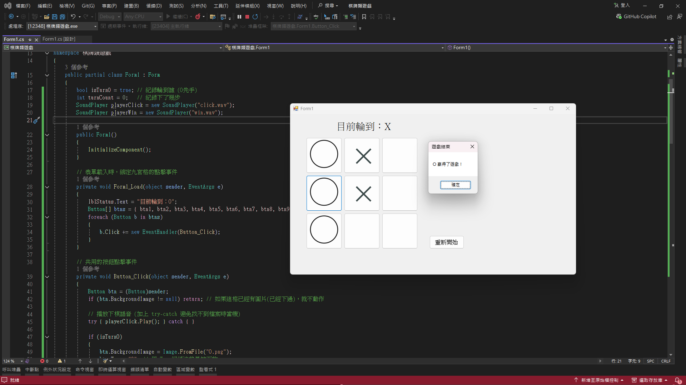

# ⭕❌ 井字棋遊戲 (Tic-Tac-Toe)

> 視窗程式設計 (II) - 作業二：棋牌類遊戲
> 使用 C# WinForms 開發，具備圖形化介面與人聲語音播報的經典九宮格井字棋。

## 📝 專案概述
本專案為一款雙人對戰的經典井字棋 (Tic-Tac-Toe) 桌面遊戲。玩家輪流在 3x3 的九宮格中下棋，程式會自動判定勝負與平手狀態。專案結合了動態圖片載入與 `System.Media.SoundPlayer` 音效播放功能，提供完整的視聽遊戲體驗。

## ✨ 核心功能與技術亮點

* **🎮 互動式圖形介面**
  * 使用 9 個 `Button` 控制項構成九宮格，並將 `BackgroundImageLayout` 設為 `Zoom`，確保 O 與 X 的圖片能完美等比例縮放適應版面。
* **🔊 智慧語音播報 (TTS)**
  * 整合線上 TTS (Text-to-Speech) 服務產生的 `.wav` 語音檔。
  * 每次玩家下棋時播放「下棋囉」音效；當有玩家獲勝時播放「遊戲結束，你贏了」的專屬音效。
* **⚡ 高效邏輯判定**
  * 運用控制項的 `Tag` 屬性來紀錄各格子的狀態 (O 或 X)。
  * 將 9 個按鈕的狀態映射至二維陣列邏輯中，精準且快速地判斷橫向、直向與兩條對角線的連線勝負。
* **⚙️ 共用事件處理**
  * 九個按鈕共用同一個 `Click` 事件 (`Button_Click`)，大幅減少冗餘的程式碼，提升專案可維護性。
  * 具備「重新開始」功能，一鍵清除畫面圖片與內部陣列狀態，無縫進行下一局遊戲。

## 💻 執行畫面
*(請將專案執行截圖命名為 screenshot.png 並放置於本目錄)*

## 🛠️ 開發環境與執行說明
* **IDE**: Visual Studio 2022
* **Framework**: Windows Forms App (.NET Framework)
* **Language**: C#
* **執行注意事項**：請確認專案目錄下的圖片素材 (`O.png`, `X.png`) 與音效素材 (`click.wav`, `win.wav`) 之「複製到輸出目錄」屬性皆已設定為 **「有更新時才複製」**，以確保執行時能順利載入資源。